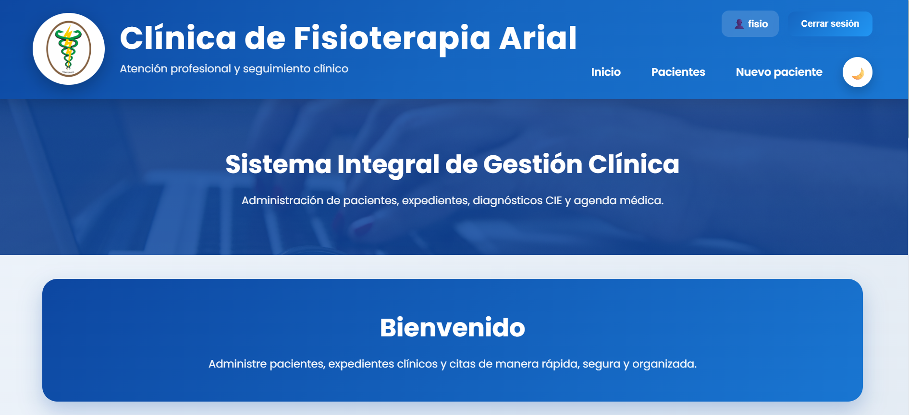
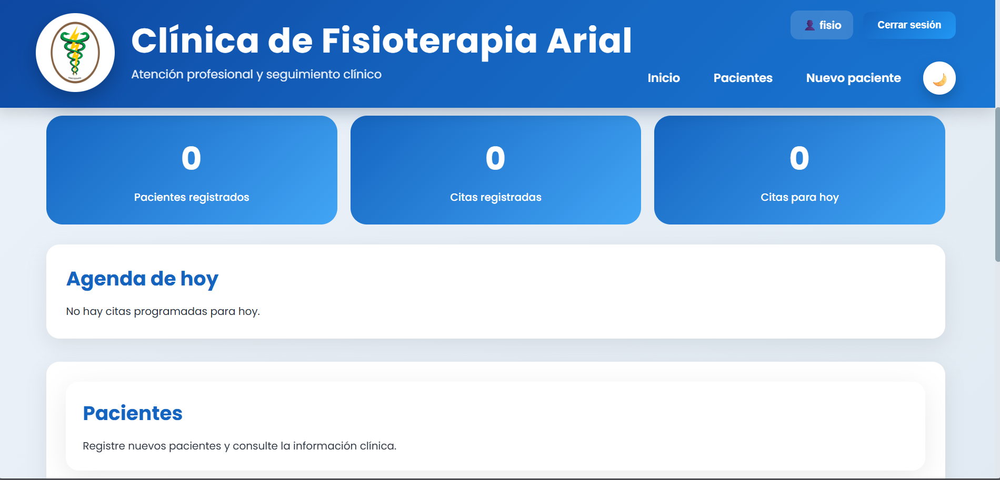
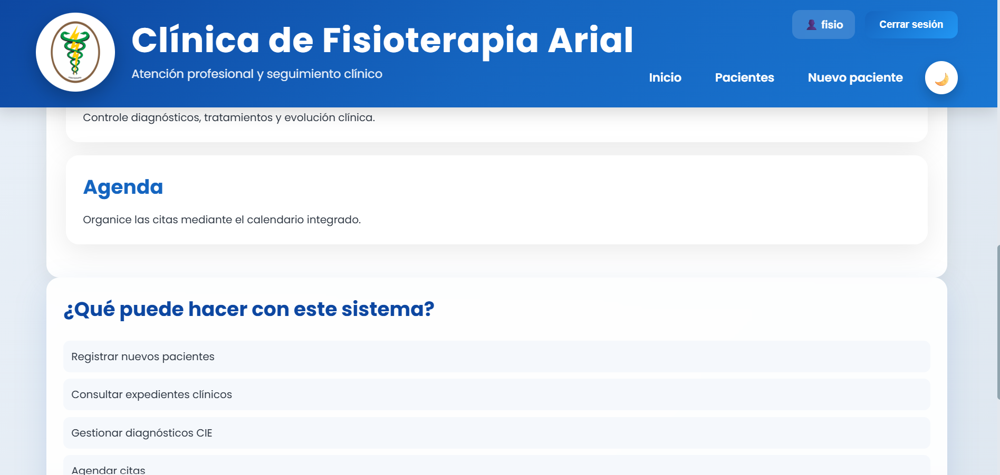
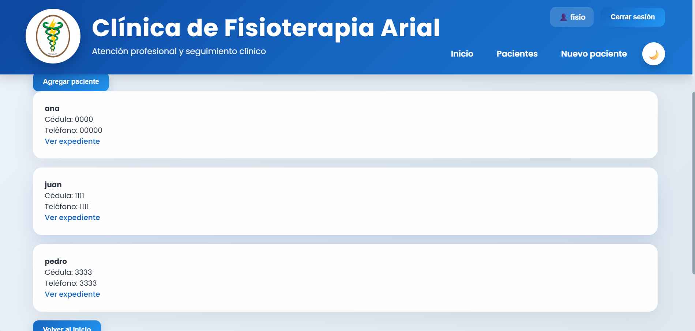
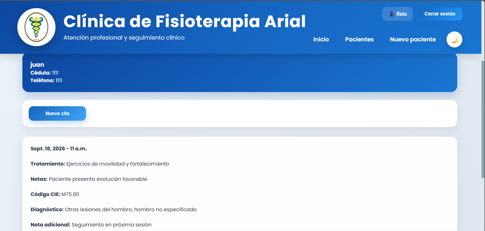
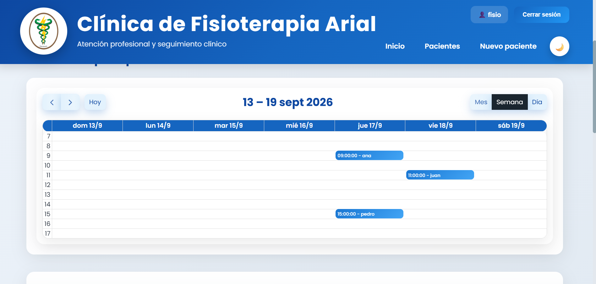
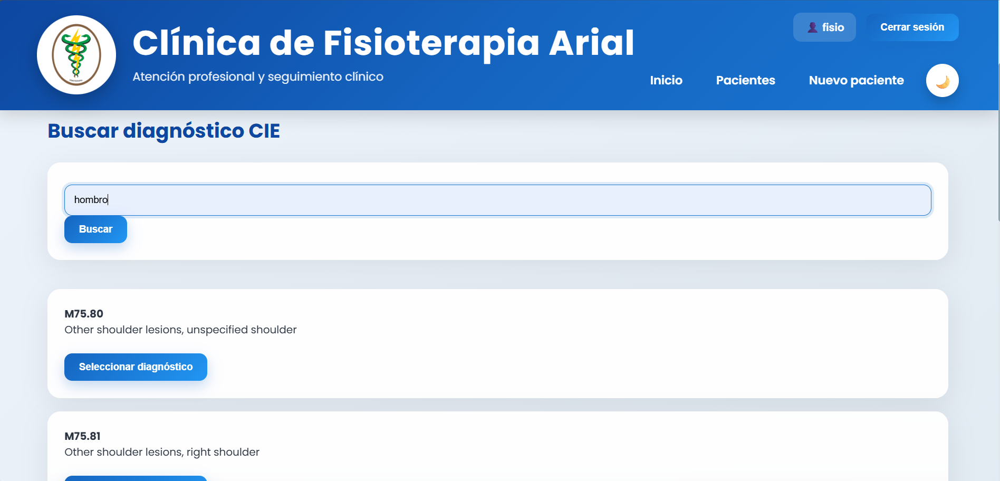
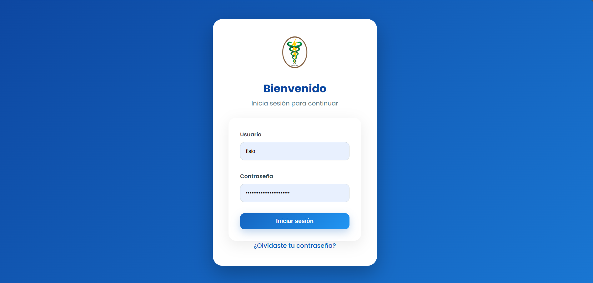
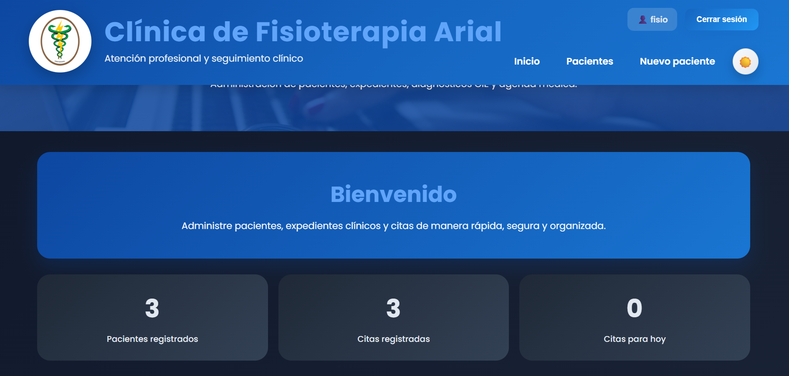

# Clínica de Fisioterapia

Sistema web para la gestión integral de una clínica de fisioterapia, desarrollado con **Django**.

La aplicación permite administrar pacientes, expedientes clínicos, citas y diagnósticos CIE, además de incorporar autenticación de usuarios y diferentes niveles de acceso según el rol.

## Características principales

### Gestión de pacientes

- Registro de nuevos pacientes.
- Consulta de pacientes registrados.
- Almacenamiento de información básica como nombre, cédula, teléfono y correo.
- Acceso al expediente clínico asociado a cada paciente.

### Expedientes clínicos

Cada expediente permite registrar y consultar información relacionada con la atención del paciente:

- Fecha y hora de la cita.
- Tratamiento.
- Notas clínicas.
- Código de diagnóstico CIE.
- Diagnóstico asociado.
- Notas adicionales.
- Edición de la información según los permisos del usuario.

### Gestión de citas

- Creación de citas asociadas a un paciente.
- Consulta de citas registradas.
- Visualización de citas mediante un calendario interactivo.
- Consulta de las citas correspondientes al día actual.
- Selección de fecha y hora para la atención.

### Diagnósticos CIE

La aplicación permite realizar búsquedas de diagnósticos mediante códigos y descripciones de la clasificación CIE.

El usuario puede consultar los resultados disponibles y seleccionar el diagnóstico que desea asociar al expediente clínico.

### Autenticación y roles

El sistema utiliza autenticación de usuarios y control de permisos para separar las funciones disponibles según el rol.

**Recepcionista:**

- Consultar pacientes.
- Registrar pacientes.
- Consultar expedientes.
- Registrar nuevas citas.
- Buscar diagnósticos CIE.
- No puede modificar expedientes existentes.

**Fisioterapeuta:**

- Consultar pacientes.
- Registrar pacientes.
- Consultar expedientes.
- Registrar nuevas citas.
- Buscar diagnósticos CIE.
- Modificar expedientes existentes.

### Interfaz y experiencia de usuario

La aplicación cuenta con una interfaz orientada a facilitar la navegación y consulta de información.

Incluye:

- Diseño responsive.
- Modo oscuro.
- Persistencia del modo oscuro mediante `localStorage`.
- Tarjetas para organizar la información.
- Animaciones y transiciones.
- Efectos visuales al mostrar elementos.
- Notificaciones mediante mensajes tipo toast.
- Contadores animados en el panel principal.
- Calendario interactivo.
- Interfaz diferenciada para las principales secciones del sistema.

## Capturas de pantalla

### Panel principal





El panel principal presenta un resumen de la información del sistema, incluyendo pacientes registrados, citas y citas correspondientes al día actual.

### Pacientes



Sección destinada a la consulta y gestión de los pacientes registrados en el sistema.

### Expediente clínico



Vista del expediente asociado a un paciente, donde se pueden consultar sus citas, tratamientos, notas y diagnósticos registrados.

### Agenda



Calendario interactivo utilizado para visualizar las citas programadas.

### Diagnósticos CIE



Interfaz para realizar búsquedas de diagnósticos utilizando códigos o descripciones CIE.
> **Nota:** actualmente la traducción automática de los diagnósticos CIE al español está presentando fallos intermitentes, por lo que algunos resultados pueden mostrarse en su idioma original (inglés). Se está trabajando en la corrección de este comportamiento.

### Inicio de sesión



Pantalla de autenticación para acceder al sistema.

### Modo oscuro



La aplicación cuenta con un modo oscuro que puede activarse desde la interfaz y cuya preferencia se conserva en el navegador.

## Tecnologías utilizadas

### Backend

- **Python 3.14**
- **Django 6.0.4**

### Frontend

- HTML5
- CSS3
- JavaScript
- Django Templates

### Librerías y herramientas

- FullCalendar
- Chart.js
- python-dotenv
- PyMySQL
- SMTP de Gmail

### Base de datos

- SQLite para el entorno de desarrollo.
- MySQL como alternativa de configuración.

## Estructura del proyecto

```text
fisioterapia_web/
│
├── manage.py
├── db.sqlite3
├── requirements.txt
├── .env
│
├── fisioterapia_web/
│   ├── __init__.py
│   ├── settings.py
│   ├── urls.py
│   ├── asgi.py
│   └── wsgi.py
│
├── miapp/
│   ├── migrations/
│   ├── templates/
│   │   ├── pacientes/
│   │   ├── expedientes/
│   │   ├── evaluaciones/
│   │   ├── cie/
│   │   ├── layout.html
│   │   └── index.html
│   │
│   ├── static/
│   │   ├── css/
│   │   ├── js/
│   │   └── images/
│   │
│   ├── models.py
│   ├── views.py
│   ├── forms.py
│   └── urls.py
│
└── docs/
    └── screenshots/
```

## Instalación

Para ejecutar el proyecto localmente, siga los siguientes pasos.

### 1. Clonar el repositorio

```bash
git clone URL_DEL_REPOSITORIO
cd fisioterapia_web
```

### 2. Crear un entorno virtual

Crear un entorno virtual para mantener aisladas las dependencias del proyecto:

```bash
python -m venv venv
```

### 3. Activar el entorno virtual

En Windows:

```bash
venv\Scripts\activate
```

Una vez activado, aparecerá `(venv)` al inicio de la línea de comandos.

### 4. Instalar las dependencias

Con el entorno virtual activo, instalar las dependencias del proyecto:

```bash
pip install -r requirements.txt
```

### 5. Configurar las variables de entorno

Crear un archivo `.env` en la raíz del proyecto y agregar las variables necesarias para la configuración de la aplicación.

Ejemplo:

```env
SECRET_KEY=tu_clave_secreta
DEBUG=True
```

Si el proyecto utiliza una base de datos MySQL, agregar también las credenciales correspondientes.

El archivo `.env` no debe subirse al repositorio, ya que puede contener información sensible.

### 6. Aplicar las migraciones

Crear y aplicar las migraciones de la base de datos:

```bash
python manage.py makemigrations
python manage.py migrate
```

### 7. Crear un usuario administrador

Crear un usuario administrador para acceder al panel de administración de Django:

```bash
python manage.py createsuperuser
```

Seguir las instrucciones mostradas en la terminal para establecer el nombre de usuario, correo electrónico y contraseña.

### 8. Ejecutar el servidor

Iniciar el servidor de desarrollo de Django:

```bash
python manage.py runserver
```

Una vez iniciado el servidor, acceder desde el navegador a:
http://127.0.0.1:8000/ 

La aplicación estará disponible para su uso local.

 Proyecto en desarrollo activo — algunas funcionalidades pueden cambiar o estar incompletas.
